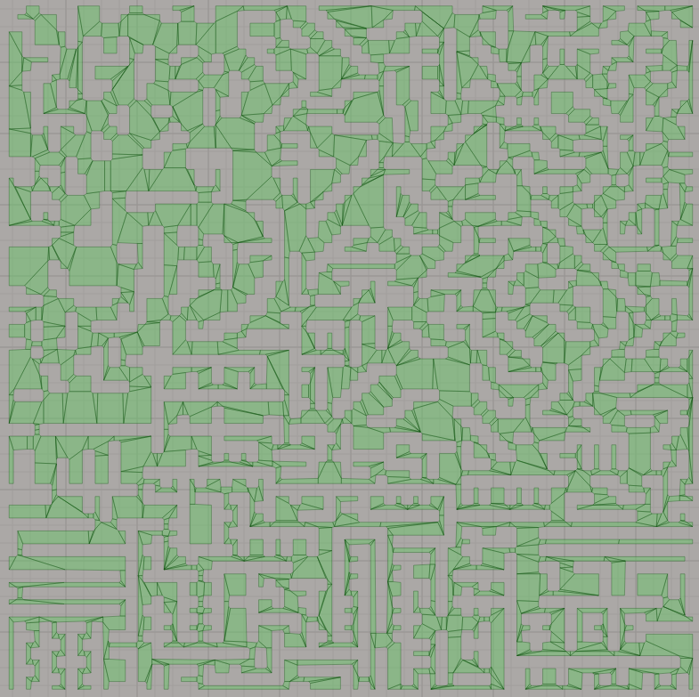
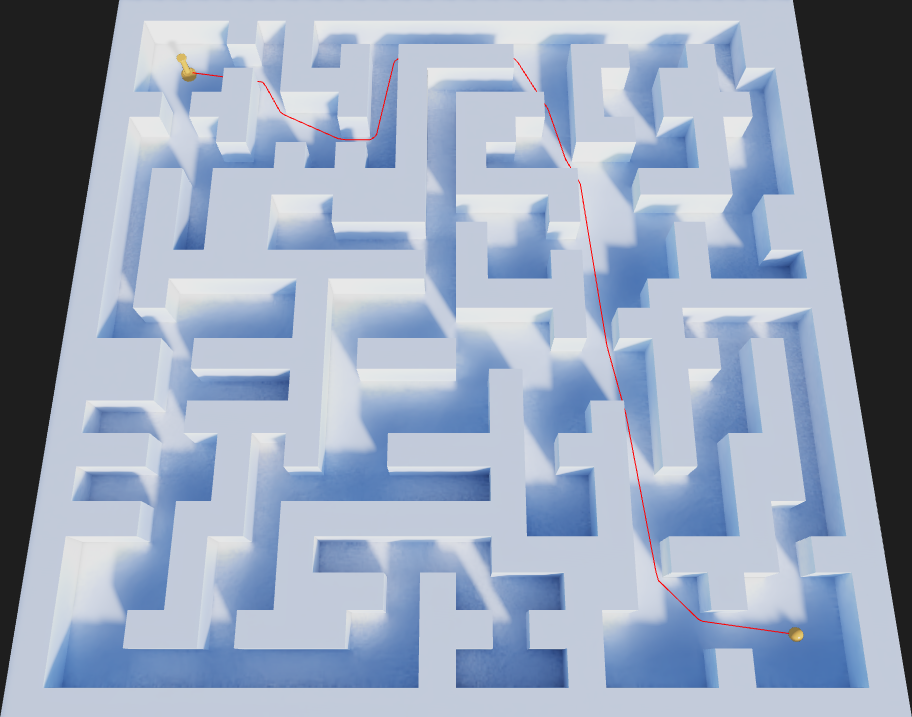
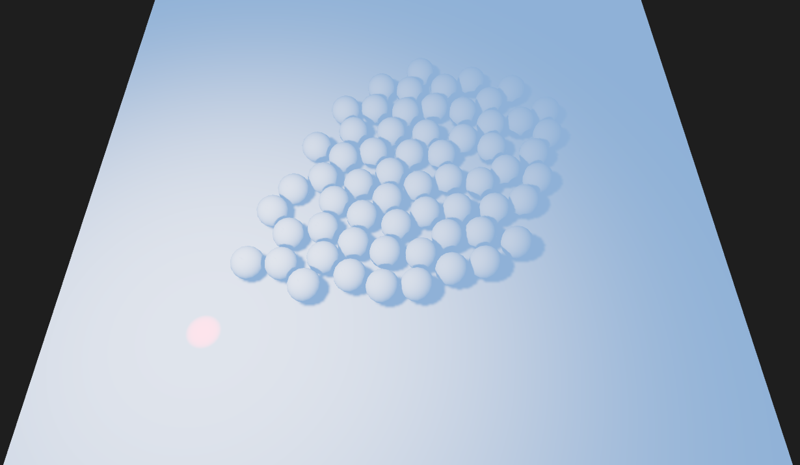

## AssemblyScript Path Finder module

The module consists of two parts. The first part find the shortest path in 3-dimensional navigation mesh. The second part use RVO2 algorithm for collision avoidance. These two parts can be used as separately, as together in one ```PathFinder``` object. This complex ```PathFinder``` object control the agents movements in the navigation mesh. The user only set the destination points for each agent, and the module executes the other routine. RVO simulations use two dimensions (x and z), while navigation mesh is three-dimensional. In ```RVOSimulator``` all agent positions are projected into xz-plane.

### Creation API

* ```create_pathfinder(vertices: Float32Array | null, polygons: Int32Array | null, sizes: Int32Array | null): PathFinder```

	Create the ```PathFinder``` object. Inputs are plain arrays with navigation mesh vertices coordinates and polygonal descriptions. If one of arrays is ```null``` then the object will be created only with ```RVOSimulator``` component on infinite XZ-plane.
	
	Polygons on the navigation mesh should be convex. Each polygon defined by the sequence of it vertex indexes. This sequence should be define the orientation of the polygon opposite to the orientation from OX axis to OZ axis.
	
	The next example demonstrate arrays that define 6-gon as two 4-sided polygons:
	
	```
	let vertices = [1.0, 0.0, 0.0,   // the first vertex
			 0.5, 0.0, -1.0,  // the second vertex
			 -0.5, 0.0, -1.0, // and so on
			 -1.0, 0.0, 0.0,
			 -0.5, 0.0, 1.0,
			 0.5, 0.0, 1.0];
	let polygons = [0, 1, 2, 3,  // the first polygon
			 0, 3, 4, 5]; //the second polygon
	let sizes = [4, 4];  // because both polygons are 4-sided
	```

* ```create_pathfinder_ext(vertices: Float32Array | null, polygons: Int32Array | null, sizes: Int32Array | null, neighbor_dist: f32, max_neighbors: i32, time_horizon: f32, time_horizon_obst: f32, agent_radius: f32, update_path_find: f32, continuous_moving: bool, move_agents: bool, snap_agents: bool, use_normals: bool): PathFinder```

	More complex version of the previous command. Allows detail setup of the ```RVOSimulator``` subcomponents and parameters of agent movement routine. If navigation mash data is not ```null``` then the boundary edges of the navmesh will be used as obstacles in each ```RVOSimulator```. These simulators will create for each connected component of the navmesh.

    * ```neighbor_dist```: the maximum distance to other agents a new agent takes into account in the simulation
    * ```max_neighbors```: the maximum number of other agents a new agent takes into account in the simulation
	* ```time_horizon```: the minimal amount of time for which a new agent's velocities that are computed by the simulation are safe with respect to other agents. The larger this number, the sooner an agent will respond to the presence of other agents, but the less freedom the agent has in choosing its velocities
	* ```time_horizon_obst```: the minimal amount of time for which a new agent's velocities that are computed by the simulation are safe with respect to obstacles. The larger this number, the sooner an agent will respond to the presence of obstacles, but the less freedom the agent has in choosing its velocities
	* ```agent_radius```: this value is used for constructing obstacle edges in ```RVOSimulator``` objects. Each edge is shifted from corresponding navmesh boundary edge at negative direction by this value
	* ```update_path_find```: the amount of time between recalculations of move paths for agents
	* ```continuous_moving```: if ```true``` then agents go to the final destination point every time, even it already has reached it. If other agent shift the agent from it final position, then it will return to the final destination
	* ```move_agents```: if ```true``` then agents will change it positions during the simulation. If ```false``` then the system will only calculate it velocities, but does not change positions
	* ```snap_agents```: if ```true``` then each update call all agents will snap to the closest point in the navigation mesh. If this value is ```false``` and the navigation mesh is not planar, then the height position of agents linear interpolated between points in the path. Also, when ```snap_agents = false```, one agent can shift the other agent outside of the navigation mesh. In this case the shifted agent will not move, because it fails to find the path to the destination point. These undesired shifts can be eliminated by properly defined ```agent_radius``` value. So, if ```snap_agents = true``` then the system is stable but less performance, if ```snap_agents = false``` then calculations are more performance, but the system is not stable in some cases
	* ```use_normals```: if ```true``` then during projections into xz-plane, proportionally change agent speeds so, that it move slowly on more steep slope

* ```create_navmesh(vertices: Float32Array, polygons: Int32Array, sizes: Int32Array): Navmesh```

	Create the ```Navmesh``` object. Parameters are the same as on ```PathFinder``` creation command.

* ```function create_rvo_simulator(neighbor_dist: f32, max_neighbors: i32, time_horizon: f32, time_horizon_obst: f32, agent_radius: f32, max_speed: f32): RVOSimulator```

	Create ```RVOSimulator``` on infinite XZ-plane. You can add obstacles to this simulator by using it API. All parameters are the same as on extended ```PathFinder``` creation command.
	* ```max_speed```: maximal speed of an agent.

* ```function create_graph(vertex_positions: Float32Array, vertices: Int32Array, edges: Int32Array): Graph```

	Create ```Graph``` object.
	* ```vertex_positions```: plain array with 3-dimensional coordinates of graph vertices
	* ```vertices```: unique identifications of vertices (it names)
	* ```edges```: plain array with pairs of vertices names. The first two value define the first edge of the graph, the third and froth values - the second edge and so on

### ```Graph``` API

* ```search(start_vertex: i32, end_vertex: i32): Int32Array```

	Find the shortest path between input vertices in the graph by using Dijkstra’s algorithm.

### ```Navmesh``` API

* ```get_groups_count(): i32```

	Return the number of connected components in the navigation mesh.

* ```search_path(s_x: f32, s_y: f32, s_z: f32, e_x: f32, e_y: f32, e_z: f32): Float32Array```

	Return coordinates of the vertices in the shortest path between input start point (with coordinates ```s_x, s_y, s_z```) and input end point (with coordinates ```e_x, e_y, e_z```). If there are no path between point, then return empty array. If the path is exists, then return array, which contains as the start point, and the finish point. All other coordinates in the output array are coordinates of the middle path points.

* ```sample(x: f32, y: f32, z: f32): Float32Array```

	Return the point in the navigation mesh, close to the input point with coordinates ```x, y, z```. Return 4-values array. If the forth value in the array is ```1.0```, then first three vales are coordinates of the closest point. If the forth values is ```0.0```, then there are no close points in the navigation mesh (and the first three values are wrong).

There are also some additional global methods for setting parameters, which should be defined before creation the navigation mesh.

* ```set_bvh_delta(delta: f32)```

	Define the delta-value, which will be used for constructing bvh inside navigation mesh. It contains two bvh structures. The first one for polygons, the second one for triangles. Delta-value used in aabb of the tree nodes.

* ```get_bvh_delta(): f32```

	Return delta-value, used for constructing bvh inside navigation mesh.

### ```RVOSimulator``` API

* ```add_agent(position_x: f32, position_y: f32): i32```

	Add a new agent to the simulator at the input position. All agent parameters (like radius, maximal speed etc) assigned from simulator parameters.

* ```add_agent_ext(position_x: f32, position_y: f32, velocity_x: f32, velocity_y: f32, radius: f32, neighbor_dist: f32, max_neighbors: i32, time_horizon: f32, time_horizon_obst: f32, max_speed: f32): i32```

	Add a new agent into simulator with complete list of parameters.

* ```delete_agent(agent_index: i32)```

	Delete agent with a given index from the simulator. Actual delete process called automatically before ```do_step``` method calls.

* ```get_agents_count(): i32```

	Return the number of agents in the simulator.

* ```add_obstacle_array(vertices: Float32Array): i32```

	Add obstacles into simulator. Input array is array of 2d-positions for the positions of line segments. The last segment between the first and the last point is added automatically.

* ```do_step(delta_time: f32, move_agents: bool = true)```

	The command to update agents velocities. It use current preferred agent velocities to calculate optimal velocities. As a result it save these velocities to ```velocity``` property of an each agent. If ```move_agents``` is ```true``` then the system also change agent positions.

* ```get_agent_max_neighbors(agent_index: i32): i32```

	Return maximum neighborhood agents count for the given agent.

* ```get_agent_max_speed(agent_index: i32): f32```

	Return agent maximum speed.

* ```get_agent_position(agent_index: i32): Vector2```

	Return agent position. The method return the pointer to ```Vector2``` object. Actual coordinates can be obtains by using methods ```vector.x()``` and ```vector.y()```.

* ```get_agents_positions(): Float32Array```

	Return plain array with all positions of all agents in the simulator. Each agent has 2d-position, so, the length of the array is x2 for agent count.

* ```get_agent_pref_velocity(agent_index: i32): Vector2```

	Return the defined preferred velocity of the agent.

* ```get_agent_radius(agent_index: i32): f32```

	Return the agent radius.

* ```get_agent_time_horizon(agent_index: i32): f32```

	Return the agent time horizon parameter.

* ```get_agent_time_horizon_obst(agent_index: i32): f32```

	Return the agent time horizon parameter for obstacles.

* ```get_agent_velocity(agent_index: i32): Vector2```

	Return agent velocity. Contains optimal values after ```do_step``` call.

* ```get_agents_velocities(): Float32Array```

	Return velocities of all agents in the simulator.

* ```query_visibility(start_x: f32, start_y: f32, end_x: f32, end_y: f32, radius: f32): bool```

	Return ```true``` if end position (with coordinates ```end_x, end_y```) is visible from start position (with coordinates ```start_x, start_y```).

* ```set_agent_position(agent_index: i32, position_x: f32, position_y: f32)```

	Set the agent position.

* ```set_agents_positions(positions: Float32Array)```

	Set positions of all agents in the simulator. Input array should contains coordinates of 2d-positions for the first agent, then for the second and so on.

* ```set_agent_pref_velocity(agent_index: i32, velocity_x: f32, velocity_y: f32)```
	
	Set preferred velocities for the agent.

* ```set_agents_pref_velocities(velocities: Float32Array)```

	Set preferred velocities for all agents in the simulator. Input array should contains coordinates of 2d-velocities for the first agent, then for the second and so on.


### ```PathFinder``` API

* ```add_agent(position_x: f32, position_y: f32, position_z: f32, radius: f32, speed: f32):```

	Create new agent at the input position with given radius and move speed. Return unique id of the new agent. If something fails, then return -1.

* ```delete_agent(agent_id: i32)```

	Delete agent with given id form the ```PathFinder``` object and all ```RVOSimulator``` subcomponents.

* ```set_agent_destination(agent_id: i32, position_x: f32, position_y: f32, position_z: f32): bool```

	Set coordinates of the destination point for a give agent. Under the hood it find the shortest path and start move agent along this path. Return ```true``` if all is ok, and ``false``` if something fails (there is no agent with input id, target point outside of the navigation mesh or in another connected component ans so on).

* ```update(delta_time: f32)```

	Update all positions and velocities of all agents in the ```PathFinder``` object. ```delta_time``` is a time between previous and current method call.

* ```get_default_agent_radius(): f32```

	Return value, used for constructing obstacles in ```RVOSimulator``` subcomponents from boundary of the navigation mesh polygons.

* ```get_all_agents_positions(): Float32Array```

	Return 3d-positions of all agents in the ```PathFinder``` object.

* ```get_all_agents_velocities(): Float32Array```

	Return 2d-velocities of all agents in all ```RVOSimulator``` subcomponents. Return values ion the same order as ```get_agents_id()``` method.

* ```get_agent_path(agent_id: i32): Float32Array```

	Return path of the agent with input id as plain float array. If there is no agent with give id, then return empty array.

* ```get_all_agents_activities(): StaticArray<bool>```

	Return boolean array with activities of all agents in the ```PathFinder``` object. Returned values in the same order as in ```get_agents_id()``` method.

* ```get_agent_activity(agent_id: i32): bool```

	Return ```ture``` if the agent with input id is active, otherwise return ```false```. Also return ```false``` if there is no agent with input id.

* ```get_agent_velocity(agent_id: i32): Float32Array```

	Return two-values array with current velocity of the input agent. If there is not agent with this id, then return empty array.

* ```get_agent_position(agent_id: i32): Float32Array```

	Return three-valued array with coordinates of the agent with input id. If there is not agent with this id, then return empty array.

* ```get_agents_count(): i32```

	Return the number of agents in the ```PathFinder``` object.

* ```get_agents_id(): Int32Array```

	Return plain integer array with unique ids of all agents.

* ```get_active_agents_count(): i32```

	Return the number of active agents in the ```PathFinder``` object. An agent is active, if it follows to the final destination.

* ```search_path(s_x: f32, s_y: f32, s_z: f32, e_x: f32, e_y: f32, e_z: f32): Float32Array```

	Return plain array with 3d-coordinates of points in the shortest path between input positions.

* ```sample(x: f32, y: f32, z: f32): Float32Array```

	Return 4-values float array with coordinates of the point in the navigation mesh, close to the input position. If the forth value is 1.0, then the answer is valid, if it equals to 0.0, then there are no close points and coordinates in the array is invalid.

* ```get_neighbor_dist(): f32```

	Return ```neighbor_dist``` parameter value used in all simulators subcomponents.

* ```get_max_neighbors(): i32```

	Return ```max_neighbors``` parameter value used in all simulators subcomponents.

* ```get_time_horizon(): f32```

	Return ```time_horizon``` parameter value used in all simulators subcomponents.

* ```get_time_horizon_obst(): f32```

	Return ```time_horizon_obst``` parameter value used in all simulators subcomponents.

* ```get_update_path_find(): f32```

	Return ```update_path_find``` parameter value.

* ```set_update_path_find(value: f32)```

	Set ```update_path_find``` parameter.

* ```get_continuous_moving(): bool```

	Return ```continuous_moving``` parameter value.

* ```set_continuous_moving(value: bool)```

	Set ```continuous_moving``` parameter.

* ```get_move_agents(): bool```

	Return ```move_agents``` parameter value.

* ```set_move_agents(value: bool)```

	Set ```move_agents``` parameter.

* ```get_snap_agents(): bool```

	Return ```snap_agents``` parameter value.

* ```set_snap_agents(value: bool)```

	Set ```snap_agents``` parameter.

* ```get_use_normals(): bool```

	Return ```use_normals``` parameter value.

* ```set_use_normals(value: bool)```

	Set ```use_normals``` parameter.

* ```get_rvo_simulator(group: i32): RVOSimulator | null```

	Return ```RVOSimulator``` on the input connected component of the navigation mesh. If navigation mesh is not defined, then input parameter ```group``` should be 0.

* ```get_navmesh(): Navmesh | null```

	Return navigation mesh subcomponent of the pathfinder object. Return ```null``` if navmesh is not defined.


## Performance comparison

### Search the shortest path algorithm

For benchmarks we use the following map:



This navigation mesh contains 2 294 polygons. We compare our WASM implementation and Recast Navigation library (which is c++, but we will use Python bindings [PyRecastDetour](https://github.com/Tugcga/PyRecastDetour)). For benchmark we generate some random pair of points and calculate the path between these points. The results in the table:

Task | WASM | PyRecastDetour
--- | --- | ---
Initialization time | 0.05 sec | 0.02 sec
1024 pairs | 0.15 sec | 0.08 sec
4096 pairs | 0.48 sec | 0.28 sec
16 384 pairs | 2.01 sec | 1.24 sec
38 416 pairs | 4.62 sec | 2.69 sec
65 536 pairs | 7.79 sec | 4.59 sec
147 456 pairs | 17.52 sec | 10.20 sec

So, our WASM version is nearly x1.7 times slowly with respect to c++ solution.


### Collision avoidance algorithm

For benchmark we simply generate a number of agents on the plane, set destination point at the center and make several simulation steps. We compare our WASM implementation (as as-RVO), compilation of the [RVO2 library](https://github.com/snape/RVO2) into [WebAssembly by Emscripten](https://github.com/Tugcga/RVO2-Emscripten) (as em-RVO) and Python bindings of the c++ version of the RVO2 library (as c-RVO).

Task | as-RVO | em-RVO | c-RVO
--- | --- | --- | ---
1000 agents, 1000 steps | 16.1 sec | 9.45 sec | 3.01 sec
100 000 agents, 1 step | 3.42 sec | 2.19 sec | 0.51 sec

So, Emscripten version is x1.6 times faster, c++ version is x6 times faster.


## Example application

[Here](https://playcanv.as/p/MID4JNwZ/) is a simple Playcanvas application, which demonstrates the basic possibilities of the module. This application contains three different scenes.

The first scene demonstrate the path finding algorithm and snapping of the agent to the navigation mesh.



The second scene demonstrate the simple case of the using RVO2 algorithm. A number of agents move in the plane to the common destination point and avoid collisions.



The third scene demonstrate the complex usage of the path finding and collision avoidance. A number of agents moves on navigation mesh to random destination points.

