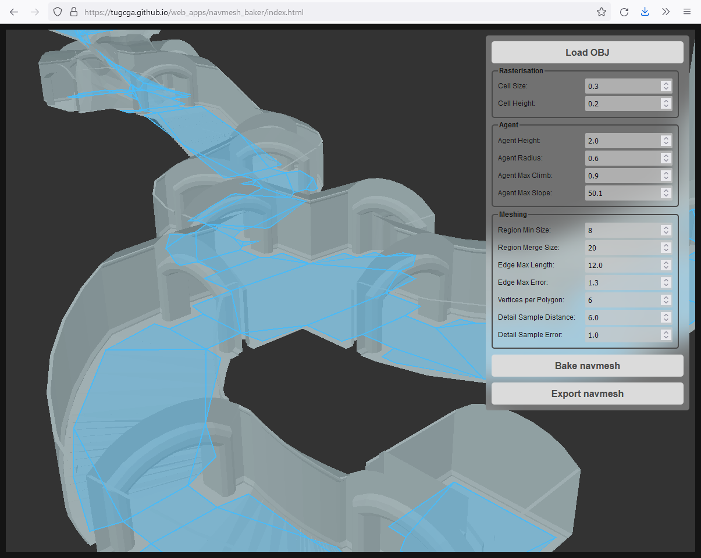

## AssemblyScript Path Finder module

The module consists of two parts. The first part find the shortest path in 3-dimensional navigation mesh. The second part use RVO2 algorithm for collision avoidance. These two parts can be used as separately, as together in one ```PathFinder``` object. This complex ```PathFinder``` object control the agents movements in the navigation mesh. The user only set the destination points for each agent, and the module executes the other routine. RVO simulations use two dimensions (x and z), while navigation mesh is three-dimensional. In ```RVOSimulator``` all agent positions are projected into xz-plane.

The module allows to bake navigation mesh polygonal data from input geometry. All you need is create ```NavmeshBaker``` object, setup input geometry and call ```bake()``` method (see API below).


### Modules structure

[Release](https://github.com/Tugcga/Path-Finder/releases/tag/as.2.1) page contains several modules, compiled from source files. These modules contains different functionality and have different sizes. If there are no limits in module size, then use the full module ```pathfinder_full.wasm```. In other cases use smaller modules with specific functionality. For example, in most cases the navigation mesh baking is not needed in the actual game application, but it should be used in the editor of the game.

Elementary modules:

* ```navmesh.wasm``` (45 kb) contains graph and navigation mesh functionality
* ```rvo.wasm``` (28 kb) contains RVO simulation functionality
* ```baker.wasm``` (80 kb) contains navigation mesh baking functionality

Combined modules:

* ```pathfinder.wasm``` (94 kb) combine ```navmesh.wasm```, ```rvo.wasm``` and also contains additional functionality for agent movements and collision avoidance on navigation mesh
* ```pathfinder_full.wasm``` (169 kb) combine ```pathfinder.wasm``` and ```baker.wasm```

### Build commands

Current version of modules designed for AssemblyScript version 0.20.x. This version allows exports only functions and does not support classes. So, there are special source files ```*_api.ts``` with all exported functionality. You should build these files only.

```navmesh.wasm```: ```asc assembly/navmesh_api.ts --outFile build/navmesh.wasm --bindings esm --exportRuntime```

```rvo.wasm```: ```asc assembly/rvo_api.ts --outFile build/rvo.wasm --bindings esm --exportRuntime```

```navmesh_baker.wasm```: ```asc assembly/baker_api.ts --outFile build/baker.wasm --bindings esm --exportRuntime```

```pathfinder.wasm```: ```asc assembly/pathfinder_api.ts assembly/navmesh_api.ts assembly/rvo_api.ts --outFile build/pathfinder.wasm --bindings esm --exportRuntime```

```pathfinder_full.wasm```: ```asc assembly/pathfinder_api.ts assembly/navmesh_api.ts assembly/rvo_api.ts assembly/baker_api.ts --outFile build/pathfinder_full.wasm --bindings esm --exportRuntime```

Of course, you can add additional compile keys for optimizations, something like ```--optimizeLevel 3 --converge --noAssert -Ospeed```

### How to use

Consider using navigation mesh module as example.

Import the module

```
import * as navmesh_exports from "./navmesh.js";
```

Form arrays with vertex coordinates and polygon descriptions

```
const vertices = [1.0, 0.0, 0.0, 0.5, 0.0, -1.0, -0.5, 0.0, -1.0, -1.0, 0.0, 0.0, -0.5, 0.0, 1.0, 0.5, 0.0, 1.0];
const polygons = [0, 1, 2, 3, 0, 3, 4, 5];
const sizes = [4, 4];
```

Create navigation mesh

```
const navmesh_ptr = navmesh_exports.create_navmesh(vertices, polygons, sizes);
```

Calculate the path between two points

```
const path = navmesh_exports.navmesh_search_path(navmesh_ptr, 0.5, 0.0, 0.5, -0.5, 0.0, -0.5);
```

### Creation API

* ```create_pathfinder(vertices: StaticArray<f32> | null, polygons: StaticArray<i32> | null, sizes: StaticArray<i32> | null): PathFinder```

	Contained in ```pathfinder.wasm``` and ```pathfinder_full.wasm```.

	Create the ```PathFinder``` object. Inputs are plain arrays with navigation mesh vertices coordinates and polygonal descriptions. If one of arrays is ```null``` then the object will be created only with ```RVOSimulator``` component on infinite XZ-plane.
	
	Polygons on the navigation mesh should be convex. Each polygon defined by the sequence of it vertex indexes. This sequence should be define the orientation of the polygon opposite to the orientation from OX axis to OZ axis.
	
	The next example demonstrate arrays that define 6-gon as two 4-sided polygons:
	
	```
	let vertices = [1.0, 0.0, 0.0,   // the first vertex
			 0.5, 0.0, -1.0,  // the second vertex
			 -0.5, 0.0, -1.0, // and so on
			 -1.0, 0.0, 0.0,
			 -0.5, 0.0, 1.0,
			 0.5, 0.0, 1.0];
	let polygons = [0, 1, 2, 3,  // the first polygon
			 0, 3, 4, 5]; //the second polygon
	let sizes = [4, 4];  // because both polygons are 4-sided
	```

* ```create_pathfinder_ext(vertices: StaticArray<f32> | null, polygons: StaticArray<i32> | null, sizes: StaticArray<i32> | null, neighbor_dist: f32, max_neighbors: i32, time_horizon: f32, time_horizon_obst: f32, agent_radius: f32, update_path_find: f32, continuous_moving: bool, move_agents: bool, snap_agents: bool, use_normals: bool): PathFinder```

	Contained in ```pathfinder.wasm``` and ```pathfinder_full.wasm```.

	More complex version of the previous command. Allows detail setup of the ```RVOSimulator``` subcomponents and parameters of agent movement routine. If navigation mash data is not ```null``` then the boundary edges of the navmesh will be used as obstacles in each ```RVOSimulator```. These simulators will create for each connected component of the navmesh.

    * ```neighbor_dist```: the maximum distance to other agents a new agent takes into account in the simulation
    * ```max_neighbors```: the maximum number of other agents a new agent takes into account in the simulation
	* ```time_horizon```: the minimal amount of time for which a new agent's velocities that are computed by the simulation are safe with respect to other agents. The larger this number, the sooner an agent will respond to the presence of other agents, but the less freedom the agent has in choosing its velocities
	* ```time_horizon_obst```: the minimal amount of time for which a new agent's velocities that are computed by the simulation are safe with respect to obstacles. The larger this number, the sooner an agent will respond to the presence of obstacles, but the less freedom the agent has in choosing its velocities
	* ```agent_radius```: this value is used for constructing obstacle edges in ```RVOSimulator``` objects. Each edge is shifted from corresponding navmesh boundary edge at negative direction by this value
	* ```update_path_find```: the amount of time between recalculations of move paths for agents
	* ```continuous_moving```: if ```true``` then agents go to the final destination point every time, even it already has reached it. If other agent shift the agent from it final position, then it will return to the final destination
	* ```move_agents```: if ```true``` then agents will change it positions during the simulation. If ```false``` then the system will only calculate it velocities, but does not change positions
	* ```snap_agents```: if ```true``` then each update call all agents will snap to the closest point in the navigation mesh. If this value is ```false``` and the navigation mesh is not planar, then the height position of agents linear interpolated between points in the path. Also, when ```snap_agents = false```, one agent can shift the other agent outside of the navigation mesh. In this case the shifted agent will not move, because it fails to find the path to the destination point. These undesired shifts can be eliminated by properly defined ```agent_radius``` value. So, if ```snap_agents = true``` then the system is stable but less performance, if ```snap_agents = false``` then calculations are more performance, but the system is not stable in some cases
	* ```use_normals```: if ```true``` then during projections into xz-plane, proportionally change agent speeds so, that it move slowly on more steep slope

* ```create_navmesh(vertices: StaticArray<f32>, polygons: StaticArray<i32>, sizes: StaticArray<i32>): Navmesh```

	Contained in ```navmesh.wasm```, ```pathfinder.wasm``` and ```pathfinder_full.wasm```.

	Create the ```Navmesh``` object. Parameters are the same as on ```PathFinder``` creation command.

* ```function create_rvo_simulator(neighbor_dist: f32, max_neighbors: i32, time_horizon: f32, time_horizon_obst: f32, agent_radius: f32, max_speed: f32): RVOSimulator```

	Contained in ```rvo.wasm```, ```pathfinder.wasm``` and ```pathfinder_full.wasm```.

	Create ```RVOSimulator``` on infinite XZ-plane. You can add obstacles to this simulator by using it API. All parameters are the same as on extended ```PathFinder``` creation command.
	* ```max_speed```: maximal speed of an agent.

* ```function create_graph(vertex_positions: StaticArray<f32>, vertices: StaticArray<i32>, edges: StaticArray<i32>): Graph```

	Contained in ```navmesh.wasm```, ```pathfinder.wasm``` and ```pathfinder_full.wasm```.

	Create ```Graph``` object.
	* ```vertex_positions```: plain array with 3-dimensional coordinates of graph vertices
	* ```vertices```: unique identifications of vertices (it names)
	* ```edges```: plain array with pairs of vertices names. The first two value define the first edge of the graph, the third and froth values - the second edge and so on

* ```create_baker(): NavmeshBaker```

	Contained in ```baker.wasm``` and ```pathfinder_full.wasm```.

	Create object, which allows to bake navigation mesh. No input parameters needed.

### ```Graph``` API

Contained in ```navmesh.wasm```, ```pathfinder.wasm``` and ```pathfinder_full.wasm```.

* ```graph_search(graph: Graph, start_vertex: i32, end_vertex: i32): StaticArray<i32>```

	Find the shortest path between input vertices in the graph by using Dijkstra’s algorithm. Input parameters are names of two vertices, output is array with names of the path's vertices.

* ```graph_to_bytes(graph: Graph): Uint8Array```

	Serialize the graph as plain bytes array.

* ```graph_from_bytes(bytes: Uint8Array): Graph```

	Deserialize the graph from input plain bytes array and return the pointer to the new graph object.

### ```Navmesh``` API

Contained in ```navmesh.wasm```, ```pathfinder.wasm``` and ```pathfinder_full.wasm```.

* ```navmesh_get_groups_count(navmesh: Navmesh): i32```

	Return the number of connected components in the navigation mesh.

* ```navmesh_search_path(navmesh: Navmesh, s_x: f32, s_y: f32, s_z: f32, e_x: f32, e_y: f32, e_z: f32): StaticArray<f32>```

	Return coordinates of the vertices in the shortest path between input start point (with coordinates ```s_x, s_y, s_z```) and input end point (with coordinates ```e_x, e_y, e_z```). If there are no path between point, then return empty array. If the path is exists, then return array, which contains as the start point, and the finish point. All other coordinates in the output array are coordinates of the middle path points.

* ```navmesh_sample(navmesh: Navmesh, x: f32, y: f32, z: f32): StaticArray<f32>```

	Return the point in the navigation mesh, close to the input point with coordinates ```x, y, z```. Return 4-values array. If the forth value in the array is ```1.0```, then first three vales are coordinates of the closest point. If the forth values is ```0.0```, then there are no close points in the navigation mesh (and the first three values are wrong).

* ```navmesh_to_bytes(navmesh: Navmesh): Uint8Array```

	Serialize the navigation mesh object as plain bytes array.

* ```navmesh_from_bytes(bytes: Uint8Array): Navmesh```

	Deserialize the navigation mesh object from input plain bytes array and return the pointer to the new navmesh object.

There are also some additional global methods for setting parameters, which should be defined before creation the navigation mesh.

* ```navmesh_set_bvh_delta(navmesh: Navmesh, delta: f32)```

	Define the delta-value, which will be used for constructing bvh inside navigation mesh. It contains two bvh structures. The first one for polygons, the second one for triangles. Delta-value used in aabb of the tree nodes.

* ```navmesh_get_bvh_delta(navmesh: Navmesh): f32```

	Return delta-value, used for constructing bvh inside navigation mesh.

### ```RVOSimulator``` API

Contained in ```rvo.wasm```, ```pathfinder.wasm``` and ```pathfinder_full.wasm```.

* ```rvo_add_agent(rvo: RVOSimulator, position_x: f32, position_y: f32): i32```

	Add a new agent to the simulator at the input position. All agent parameters (like radius, maximal speed etc) assigned from simulator parameters.

* ```rvo_add_agent_ext(rvo: RVOSimulator, position_x: f32, position_y: f32, velocity_x: f32, velocity_y: f32, radius: f32, neighbor_dist: f32, max_neighbors: i32, time_horizon: f32, time_horizon_obst: f32, max_speed: f32): i32```

	Add a new agent into simulator with complete list of parameters.

* ```rvo_delete_agent(rvo: RVOSimulator, agent_index: i32)```

	Delete agent with a given index from the simulator. Actual delete process called automatically before ```do_step``` method calls.

* ```rvo_get_agents_count(rvo: RVOSimulator): i32```

	Return the number of agents in the simulator.

* ```rvo_add_obstacle_array(rvo: RVOSimulator, vertices: StaticArray<f32>): i32```

	Add obstacles into simulator. Input array is array of 2d-positions for the positions of line segments. The last segment between the first and the last point is added automatically.

* ```rvo_do_step(rvo: RVOSimulator, delta_time: f32, move_agents: bool = true)```

	The command to update agents velocities. It use current preferred agent velocities to calculate optimal velocities. As a result it save these velocities to ```velocity``` property of an each agent. If ```move_agents``` is ```true``` then the system also change agent positions.

* ```rvo_get_agent_max_neighbors(rvo: RVOSimulator, agent_index: i32): i32```

	Return maximum neighborhood agents count for the given agent.

* ```rvo_get_agent_max_speed(rvo: RVOSimulator, agent_index: i32): f32```

	Return agent maximum speed.

* ```rvo_get_agent_position(rvo: RVOSimulator, agent_index: i32): Vector2```

	Return agent position. The method return the pointer to ```Vector2``` object. Actual coordinates can be obtains by using functions ```vector2_x(vector: Vector2)``` and ```vector2_y(vector: Vector2)```.

* ```rvo_get_agents_positions(rvo: RVOSimulator): StaticArray<f32>```

	Return plain array with all positions of all agents in the simulator. Each agent has 2d-position, so, the length of the array is x2 for agent count.

* ```rvo_get_agent_pref_velocity(rvo: RVOSimulator, agent_index: i32): Vector2```

	Return the defined preferred velocity of the agent.

* ```rvo_get_agent_radius(rvo: RVOSimulator, agent_index: i32): f32```

	Return the agent radius.

* ```rvo_get_agent_time_horizon(rvo: RVOSimulator, agent_index: i32): f32```

	Return the agent time horizon parameter.

* ```rvo_get_agent_time_horizon_obst(rvo: RVOSimulator, agent_index: i32): f32```

	Return the agent time horizon parameter for obstacles.

* ```rvo_get_agent_velocity(rvo: RVOSimulator, agent_index: i32): Vector2```

	Return agent velocity. Contains optimal values after ```do_step``` call.

* ```rvo_get_agents_velocities(rvo: RVOSimulator): StaticArray<f32>```

	Return velocities of all agents in the simulator.

* ```rvo_query_visibility(rvo: RVOSimulator, start_x: f32, start_y: f32, end_x: f32, end_y: f32, radius: f32): bool```

	Return ```true``` if end position (with coordinates ```end_x, end_y```) is visible from start position (with coordinates ```start_x, start_y```).

* ```rvo_set_agent_position(rvo: RVOSimulator, agent_index: i32, position_x: f32, position_y: f32)```

	Set the agent position.

* ```rvo_set_agents_positions(rvo: RVOSimulator, positions: StaticArray<f32>)```

	Set positions of all agents in the simulator. Input array should contains coordinates of 2d-positions for the first agent, then for the second and so on.

* ```rvo_set_agent_pref_velocity(rvo: RVOSimulator, agent_index: i32, velocity_x: f32, velocity_y: f32)```
	
	Set preferred velocities for the agent.

* ```rvo_set_agents_pref_velocities(rvo: RVOSimulator, velocities: StaticArray<f32>)```

	Set preferred velocities for all agents in the simulator. Input array should contains coordinates of 2d-velocities for the first agent, then for the second and so on.


### ```PathFinder``` API

Contained in ```pathfinder.wasm``` and ```pathfinder_full.wasm```.

* ```pathfinder_add_agent(pathfinder: PathFinder, position_x: f32, position_y: f32, position_z: f32, radius: f32, speed: f32)```

	Create new agent at the input position with given radius and move speed. Return unique id of the new agent. If something fails, then return -1.

* ```pathfinder_delete_agent(pathfinder: PathFinder, agent_id: i32)```

	Delete agent with given id form the ```PathFinder``` object and all ```RVOSimulator``` subcomponents.

* ```pathfinder_set_agent_destination(pathfinder: PathFinder, agent_id: i32, position_x: f32, position_y: f32, position_z: f32): bool```

	Set coordinates of the destination point for a give agent. Under the hood it find the shortest path and start move agent along this path. Return ```true``` if all is ok, and ``false``` if something fails (there is no agent with input id, target point outside of the navigation mesh or in another connected component ans so on).

* ```pathfinder_update(pathfinder: PathFinder, delta_time: f32)```

	Update all positions and velocities of all agents in the ```PathFinder``` object. ```delta_time``` is a time between previous and current method call.

* ```pathfinder_get_default_agent_radius(pathfinder: PathFinder): f32```

	Return value, used for constructing obstacles in ```RVOSimulator``` subcomponents from boundary of the navigation mesh polygons.

* ```pathfinder_get_all_agents_positions(pathfinder: PathFinder): StaticArray<f32>```

	Return 3d-positions of all agents in the ```PathFinder``` object.

* ```pathfinder_get_all_agents_velocities(pathfinder: PathFinder): StaticArray<f32>```

	Return 2d-velocities of all agents in all ```RVOSimulator``` subcomponents. Return values ion the same order as ```get_agents_id()``` method.

* ```pathfinder_get_agent_path(pathfinder: PathFinder, agent_id: i32): Float32Array```

	Return path of the agent with input id as plain float array. If there is no agent with give id, then return empty array.

* ```pathfinder_get_all_agents_activities(pathfinder: PathFinder): StaticArray<bool>```

	Return boolean array with activities of all agents in the ```PathFinder``` object. Returned values in the same order as in ```get_agents_id()``` method.

* ```pathfinder_get_agent_activity(pathfinder: PathFinder, agent_id: i32): bool```

	Return ```ture``` if the agent with input id is active, otherwise return ```false```. Also return ```false``` if there is no agent with input id.

* ```pathfinder_get_agent_velocity(pathfinder: PathFinder, agent_id: i32): StaticArray<f32>```

	Return two-values array with current velocity of the input agent. If there is not agent with this id, then return empty array.

* ```pathfinder_get_agent_position(pathfinder: PathFinder, agent_id: i32): StaticArray<f32>```

	Return three-valued array with coordinates of the agent with input id. If there is not agent with this id, then return empty array.

* ```pathfinder_get_agents_count(pathfinder: PathFinder): i32```

	Return the number of agents in the ```PathFinder``` object.

* ```pathfinder_get_agents_id(pathfinder: PathFinder): StaticArray<i32>```

	Return plain integer array with unique ids of all agents.

* ```pathfinder_get_active_agents_count(pathfinder: PathFinder): i32```

	Return the number of active agents in the ```PathFinder``` object. An agent is active, if it follows to the final destination.

* ```pathfinder_search_path(pathfinder: PathFinder, s_x: f32, s_y: f32, s_z: f32, e_x: f32, e_y: f32, e_z: f32): Float32Array```

	Return plain array with 3d-coordinates of points in the shortest path between input positions.

* ```pathfinder_sample(pathfinder: PathFinder, x: f32, y: f32, z: f32): StaticArray<f32>```

	Return 4-values float array with coordinates of the point in the navigation mesh, close to the input position. If the forth value is 1.0, then the answer is valid, if it equals to 0.0, then there are no close points and coordinates in the array is invalid.

* ```pathfinder_get_neighbor_dist(pathfinder: PathFinder): f32```

	Return ```neighbor_dist``` parameter value used in all simulators subcomponents.

* ```pathfinder_get_max_neighbors(pathfinder: PathFinder): i32```

	Return ```max_neighbors``` parameter value used in all simulators subcomponents.

* ```pathfinder_get_time_horizon(pathfinder: PathFinder): f32```

	Return ```time_horizon``` parameter value used in all simulators subcomponents.

* ```pathfinder_get_time_horizon_obst(pathfinder: PathFinder): f32```

	Return ```time_horizon_obst``` parameter value used in all simulators subcomponents.

* ```pathfinder_get_update_path_find(pathfinder: PathFinder): f32```

	Return ```update_path_find``` parameter value.

* ```pathfinder_set_update_path_find(pathfinder: PathFinder, value: f32)```

	Set ```update_path_find``` parameter.

* ```pathfinder_get_continuous_moving(pathfinder: PathFinder): bool```

	Return ```continuous_moving``` parameter value.

* ```pathfinder_set_continuous_moving(pathfinder: PathFinder, value: bool)```

	Set ```continuous_moving``` parameter.

* ```pathfinder_get_move_agents(pathfinder: PathFinder): bool```

	Return ```move_agents``` parameter value.

* ```pathfinder_set_move_agents(pathfinder: PathFinder, value: bool)```

	Set ```move_agents``` parameter.

* ```pathfinder_get_snap_agents(pathfinder: PathFinder): bool```

	Return ```snap_agents``` parameter value.

* ```pathfinder_set_snap_agents(pathfinder: PathFinder, value: bool)```

	Set ```snap_agents``` parameter.

* ```pathfinder_get_use_normals(pathfinder: PathFinder): bool```

	Return ```use_normals``` parameter value.

* ```pathfinder_set_use_normals(pathfinder: PathFinder, value: bool)```

	Set ```use_normals``` parameter.

* ```pathfinder_get_rvo_simulator(pathfinder: PathFinder, group: i32): RVOSimulator | null```

	Return ```RVOSimulator``` on the input connected component of the navigation mesh. If navigation mesh is not defined, then input parameter ```group``` should be 0.

* ```pathfinder_get_navmesh(pathfinder: PathFinder): Navmesh | null```

	Return navigation mesh subcomponent of the pathfinder object. Return ```null``` if navmesh is not defined.

	
### ```NavmeshBaker``` API

Contained in ```baker.wasm``` and ```pathfinder_full.wasm```.

* ```baker_add_geometry(baker: NavmeshBaker, vertices: StaticArray<f32>, polygons: StaticArray<i32>, sizes: StaticArray<i32>)```

	Add input polygons to the baker object. ```vertices``` is a plain float array with vertex positions, ```polygons``` is a plain array with polygon corners indices, ```sizes``` is a plain array with polygon sizes. You can call this method several times, but at each call polygon indices should be in local enumeration (the minimum is 0, the maximum is ```vertices.length / 3```).

* ```baker_bake(baker: NavmeshBaker, cell_size: f64, cell_height: f64, agent_height: f64, agent_radius: f64, agent_max_climb: f64, agent_max_slope: f64, region_min_size: i32, region_merge_size: i32, edge_max_len: f64, edge_max_error: f64, verts_per_poly: i32, detail_sample_distance: f64, detail_sample_maximum_error: f64): bool```

	Bake navigation mesh ad return ```true``` if all done and ```false``` in other case. There are many input paramters for the baking process. Recommended start values are the following: 
	
	```cell_size = 0.3```, 
	
	```cell_height = 0.2```, 
	
	```agent_height = 2.0```, 
	
	```agent_radius = 0.6```, 
	
	```agent_max_climb = 0.9```, 
	
	```agent_max_slope = 45.0```, 
	
	```region_min_size = 8```, 
	
	```region_merge_size = 20```, 
	
	```edge_max_len = 12.0```, 
	
	```edge_max_error = 1.3```, 
	
	```verts_per_poly = 6```, 
	
	```detail_sample_distance = 6.0```, 
	
	```detail_sample_maximum_error = 1.0```.
	
	The most important are
	
	```cell_size``` define the voxels size in rasterization process. Less values allows to catch small details but produce more density mesh.

	```cell_height``` define voxels height.
	
	```agent_radius``` define radius of the agents, which will be moved by navigation mesh. In fact this values define the gap between walls and actual navigation mesh polygons.
	
	```agent_max_slope``` define the slope in degrees where agents can move.
	
	```verts_per_poly``` define how many vertices polygons in the navigation mesh can contains. If this value is equal to 3, the output mesh will be triangulated.

* ```baker_get_navmesh_vertices(baker: NavmeshBaker): StaticArray<f64>```

	Return plain float array with vertex coordinates of the baked navigation mesh (or empty array if the navigation mesh is not baked).

* ```baker_get_navmesh_polygons(baker: NavmeshBaker): StaticArray<i32>```

	Return plain integer array with polygon vertex indices of the baked navigation mesh (or empty array if the navigation mesh is not baked).
	
* ```baker_get_navmesh_sizes(baker: NavmeshBaker): StaticArray<i32>```

	Return plain integer array with sizes of the baked navigation mesh polygons (or empty array if the navigation mesh is not baked).

### Serialization/Deserialization

It is possible to save navigation mesh object into file and load the object from input file. It may be useful when one application bakes the navigation mesh and saves complete object into external file, and then an other application loads this file and use navigation mesh object.

#### How to use

Load the module

```
import * as navmesh_exports from "./navmesh.js";
```

Assume that ```navmesh_ptr``` is a pointer to the navigation mesh object in the WASM memory (created, from the polygonal data, for example). Serialize it to bytes

```
const nm_bytes = navmesh_exports.navmesh_to_bytes(navmesh_ptr);
```

Next you can save this bytes into file.

Deserialize object from file

```
const navmesh_ptr = navmesh_exports.navmesh_from_bytes(nm_bytes);
```


## Performance comparison

### Search the shortest path algorithm

For benchmarks we use the following map:


This navigation mesh contains 2 294 polygons. We compare our WASM implementation and Recast Navigation library (which is c++, but we will use Python bindings [PyRecastDetour](https://github.com/Tugcga/PyRecastDetour)). For benchmark we generate some random pair of points and calculate the path between these points. The results in the table:

Task | WASM | PyRecastDetour
--- | --- | ---
Initialization time | 0.05 sec | 0.02 sec
1024 pairs | 0.10 sec | 0.08 sec
4096 pairs | 0.38 sec | 0.28 sec
16 384 pairs | 1.48 sec | 1.24 sec
38 416 pairs | 3.43 sec | 2.69 sec
65 536 pairs | 5.82 sec | 4.59 sec
147 456 pairs | 13.21 sec | 10.20 sec

So, our WASM version is nearly x1.3 times slowly with respect to c++ solution. There are several reasons, why our solution is close to the native speed:
* Our algorithm is different from the Recast Navigation algorithm
* There are many interactions between environment and the module. May be the overhead for calling WASM function is smaller that overhead for calling c++ function from Python. This interaction can spend the most time with respect to actual path finding time.


### Collision avoidance algorithm

For benchmark we simply generate a number of agents on the plane, set destination point at the center and make several simulation steps. We compare our WASM implementation (as as-RVO), compilation of the [RVO2 library](https://github.com/snape/RVO2) into [WebAssembly by Emscripten](https://github.com/Tugcga/RVO2-Emscripten) (as em-RVO) and Python bindings of the c++ version of the RVO2 library (as c-RVO).

Task | as-RVO | em-RVO | c-RVO
--- | --- | --- | ---
1000 agents, 1000 steps | 14.21 sec | 9.45 sec | 3.01 sec
100 000 agents, 1 step | 3.22 sec | 2.19 sec | 0.51 sec

So, Emscripten version is x1.5 times faster, c++ version is x5 times faster.


### Navmesh baking

For baking benchmark we use two methods. The first method is called ```plane```. We generate a large plane with the center at the origin and bake the navmesh for it. The complexity defined by the plane size. The second method is called ```cubes```. We generate random cubes in the space and bake navmesh for these cubes. The complexity defined by the number of cubes. Also we compare the performance with [PyRecastDetour](https://github.com/Tugcga/PyRecastDetour)), which implements the same baking algorithm.

```plane``` benchmark:

Size | WASM | PyRecastDetour
--- | --- | ---
4.0 | 0.0018 sec | 0.0 sec
16.0 | 0.033 sec | 0.004 sec
32.0 | 0.15 sec | 0.016 sec
64.0 | 0.74 sec | 0.069 sec
96.0 | 1.88 sec | 0.14 sec
128.0 | 4.39 sec | 0.31 sec
192.0 | 10.04 sec | 0.78 sec

So, c++ solution x10-x12 times faster.

```cubes``` benchmark:

Count | WASM | PyRecastDetour
--- | --- | ---
16 | 0.11 sec | 0.001 sec
32 | 0.19 sec | 0.013 sec
64 | 0.35 sec | 0.019 sec
128 | 0.58 sec | 0.032 sec
256 | 1.14 sec | 0.047 sec
512 | 2.18 sec | 0.086 sec
1024 | 4.39 sec | 0.16 sec

So, c++ solution near x20 times faster.


### Deserialization navmesh

We make the following experiment. Generate random navigation mesh polygonal data, and then:
* Initialize the navigation mesh object from this data
* Serialize constructed navigation mesh object into bytes
* Deserialize navigation mesh object from these bytes
* Compress and decompress bytes by using [pako](https://github.com/nodeca/pako) module with default parameters

In the following table we write performance results of these tasks for different mesh sizes. By ```Polygonal data size```  we mean the size of the raw polygonal data in bytes (in fact the ```number_of_vertices x12 + number_of_polygons x8```). All other sizes are also in bytes.

Polygons | Init time | Serialization time | Deserialization time | Polygonal data size | Serialized file size | Compressed file size | Decompress time 
--- | --- | --- | --- | --- | --- | --- | ---
2 077 | 0.028 sec | 0.077 sec | 0.022 sec | 91 800 | 2 170 433 | 288 687 | 0.053 sec
8 141 | 0.14 sec | 0.36 sec | 0.14 sec | 364 172 | 8 752 069 | 1 174 633 | 0.1 sec
18 567 | 0.34 sec | 0.99 sec | 0.24 sec | 818 708 | 19 878 401 | 2 745 445 | 0.23 sec
32 821 | 0.67 sec | 1.85 sec | 0.39 sec | 1 447 508 | 35 103 385 | 4 823 961 | 0.29 sec
48 753 | 0.96 sec | 2.81 sec | 0.60 sec | 2 149 108 | 52 294 249 | 7 306 457 | 0.39 sec

Conclusions:
* Deserialiation from the file is faster than initialization from polygonal data, but not too much (```x1.5``` times faster)
* File with serialized data is much bigger, because it contains not only polygonal data, but also additional structures, required for searching path and triangles samples (the file is ```x25``` bigger)
* Output file with serialized data can be effectively compressed (```x7.5``` times)
* Decompression and deserialization is slowly then direct initialization from polygonal data


## Navmesh Baker web application

[Here](https://tugcga.github.io/web_apps/navmesh_baker/index.html) is a small application, which use ```baker.wasm``` module for building navigation mesh for the input geometry.



You can use this application in the following way:
* Click ```Load OBJ``` button and select ```*.obj``` file with level gemoetry
* Setup bake settings and press ```Bake navmesh``` button
* Rotate and move the camera by using mouse: LMB - rotate, MMB and Wheel - zoom, RMB - pan
* When navmesh is generated, click ```Export navmesh``` button to save the polygon description of the mesh into ```*.txt``` file and save it into the local drive

The application use [OGL](https://github.com/oframe/ogl) for 3d-rendering, [obj-file-parser](https://github.com/Deckeraga/obj-file-parser-ts) for loading ```*.obj``` files and [FileSaver.js](https://github.com/eligrey/FileSaver.js/) for save output ```*.txt``` file.


## Example application

[Here](https://playcanv.as/p/MID4JNwZ/) is a simple Playcanvas application, which demonstrates the basic possibilities of the module. This application contains three different scenes.

The first scene demonstrate the path finding algorithm and snapping of the agent to the navigation mesh.


The second scene demonstrate the simple case of the using RVO2 algorithm. A number of agents move in the plane to the common destination point and avoid collisions.


The third scene demonstrate the complex usage of the path finding and collision avoidance. A number of agents moves on navigation mesh to random destination points.


This application use the old version of the module. The functionality is the same, but there are some difference with the module import process. The old version used the AssemblyScript loader, but current version use automatically generated bindings.